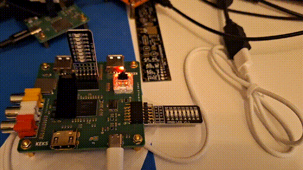

# Retro-Amaranth
Various FPGA Amaranth projects

# Machdyne Keks
This video shows Amaranth running a memory test for a selected bank. The vertical pmod shows the upper address bits and the horizontal pmod shows a code "111" = pass, "101" = fail.



# Clockworks timing
```
Increasing the exponent value, for example, from 2^5 to 2^6
increases the period but doesn't change the simulation step size.
The step-size can't be changed, only the duration and period.
If we specify 1000e-6 (1ms) for the deadline, in the bench, that gives
1000 step duration.

                         duration
|-----------------------------------------------------------------|
\_________/``````````\_________/``````````\_________/``````````\__
          |--------------------|
              period = clock

Example 1: 2^5 yields ~33 steps between clock edges or 18 clocks
    over a duration of 1000 steps.
Example 2: 2^6 yields ~65 steps between clock edges or 8 clocks
    over a duration of 1000 steps.
Example 3: 2^7 yields ~129 steps between clock edges or 4 clocks
    over a duration of 1000 steps.
Example 4: 2^8 yields ~257 steps between clock edges or 2 clocks
    over a duration of 1000 steps.
Example 5: 2^9 yields ~513 steps between clock edges or 1 clock
    over a duration of 1000 steps.
Example 6: 2^10 yields 0 clocks over a duration of 1000 steps.
    However, if you increase the deadline (i.e. duration) to 2000e-6
    you will now yield ~1025 steps between clock edges 
    or 1 clock over a duration of 2000 steps.
    Thus as you increase the deadline (aka simulation window),
    you add more clock edges to the simulation.
For a CPU simulation you will typically need several or more clocks
to execute an instruction. Thus you need a duration long enough
to execute all instructions.
For example:
A period of 2^5 and a duration of 100e-3 (100ms) gives 1562 clocks, and
the simulation take 100000 steps.
For the Femto that means 1562(clocks)/4(clocks per instruction) ~= 390
instructions. The simulation takes about 3 seconds to run on a
13th gen 16 thread intel.
```

```python
cw = Clockworks(slow=19, sim_slow=5)
```
